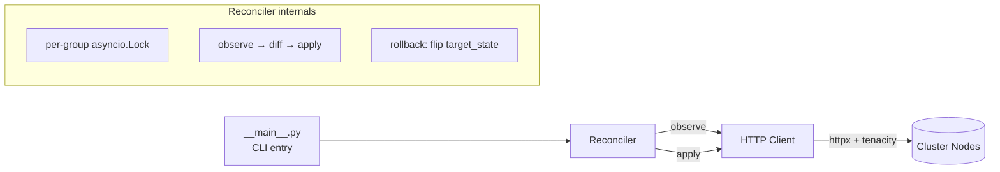
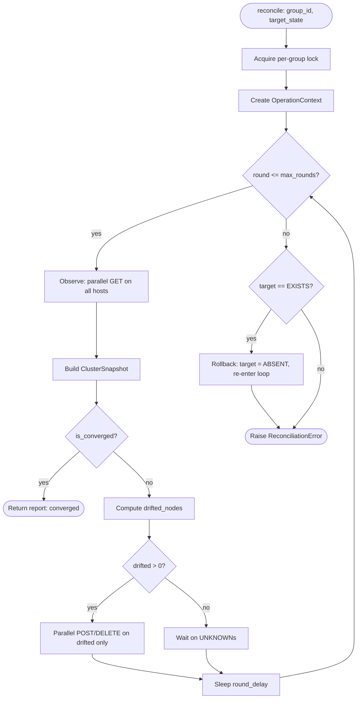
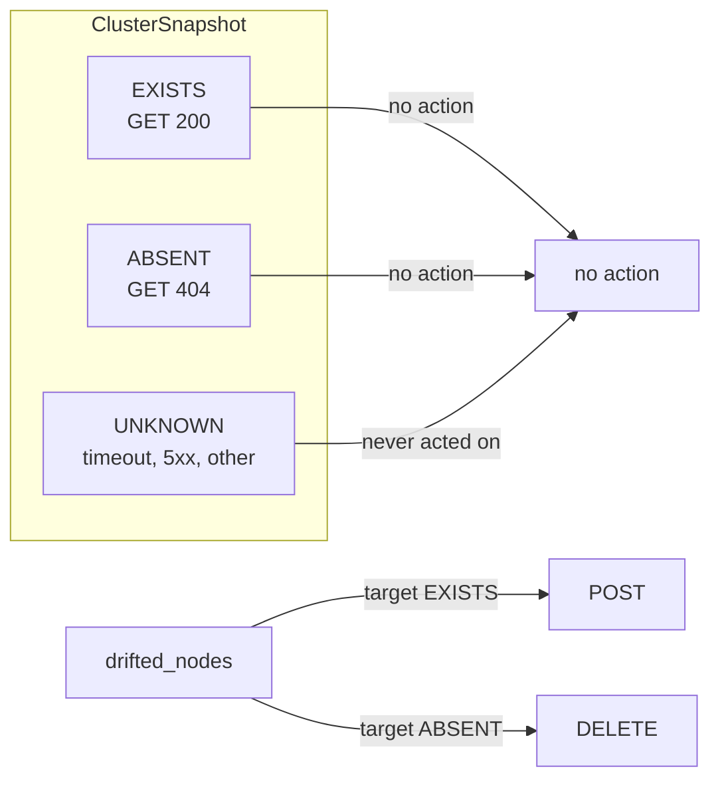
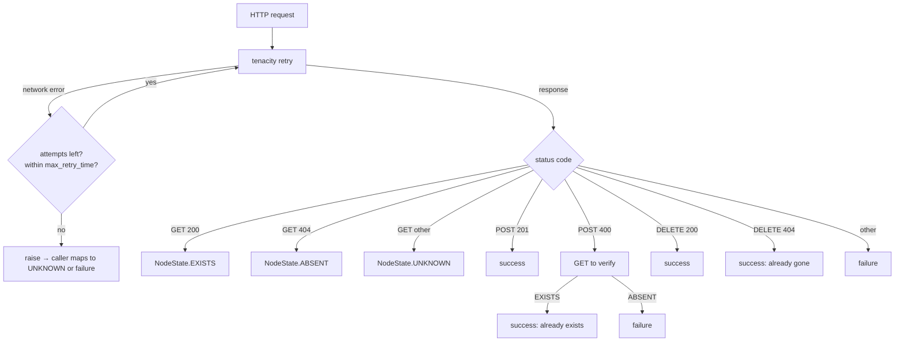
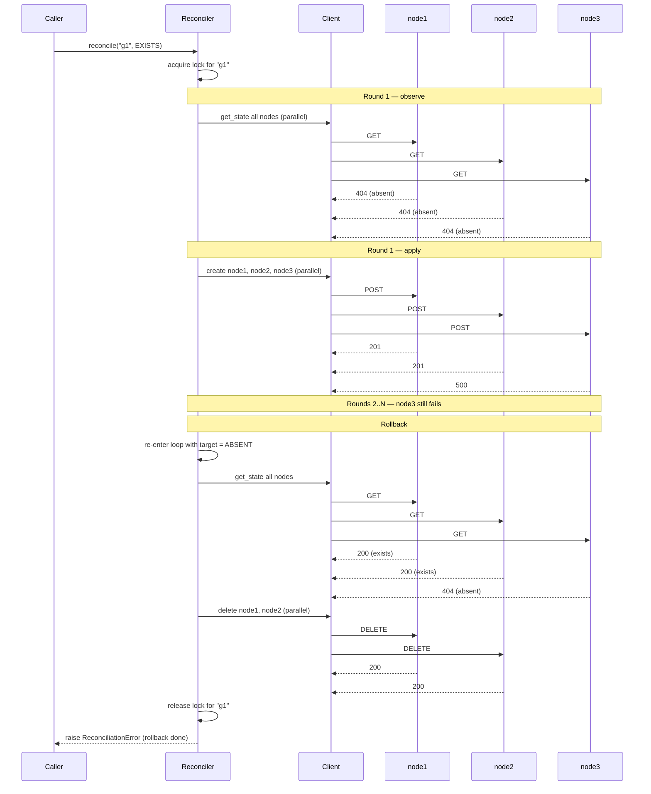
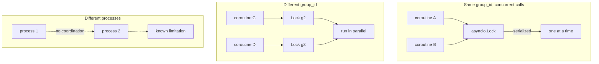

# Architecture

## High-level flow

```mermaid
flowchart LR
    CLI["__main__.py<br/>CLI entry"] --> R[Reconciler]
    R -->|observe| C[HTTP Client]
    R -->|apply| C
    C -->|httpx + tenacity| Cluster[(Cluster Nodes)]

    subgraph R2[Reconciler internals]
        Lock[per-group asyncio.Lock]
        Loop[observe → diff → apply]
        RB[rollback: flip target_state]
    end
```

## Reconciliation loop

```mermaid
flowchart TD
    Start([reconcile: group_id, target_state]) --> Lock[Acquire per-group lock]
    Lock --> Init[Create OperationContext]
    Init --> Round{round <= max_rounds?}

    Round -->|yes| Observe[Observe: parallel GET on all hosts]
    Observe --> Snapshot[Build ClusterSnapshot]
    Snapshot --> Converged{is_converged?}

    Converged -->|yes| Success([Return report: converged])
    Converged -->|no| Diff[Compute drifted_nodes]

    Diff --> HasDrift{drifted > 0?}
    HasDrift -->|yes| Apply[Parallel POST/DELETE on drifted only]
    HasDrift -->|no| Wait[Wait on UNKNOWNs]
    Apply --> Sleep[Sleep round_delay]
    Wait --> Sleep
    Sleep --> Round

    Round -->|no| Failed{target == EXISTS?}
    Failed -->|yes| Rollback[Rollback: target = ABSENT, re-enter loop]
    Rollback --> Raises([Raise ReconciliationError])
    Failed -->|no| Raises
```

## Node state model

```mermaid
flowchart LR
    subgraph Snapshot[ClusterSnapshot]
        EXISTS["EXISTS<br/>GET 200"]
        ABSENT["ABSENT<br/>GET 404"]
        UNKNOWN["UNKNOWN<br/>timeout, 5xx, other"]
    end

    EXISTS -->|no action| NoOp[no action]
    ABSENT -->|no action| NoOp
    UNKNOWN -->|never acted on| NoOp

    Drift[drifted_nodes] -->|target EXISTS| POST[POST]
    Drift -->|target ABSENT| DELETE[DELETE]
```

## Client decision matrix

```mermaid
flowchart TD
    Req[HTTP request] --> Retry[tenacity retry]
    Retry -->|network error| RetryLoop{attempts left?<br/>within max_retry_time?}
    RetryLoop -->|yes| Retry
    RetryLoop -->|no| Exhausted["raise → caller maps to UNKNOWN or failure"]

    Retry -->|response| Status{status code}

    Status -->|GET 200| GE[NodeState.EXISTS]
    Status -->|GET 404| GA[NodeState.ABSENT]
    Status -->|GET other| GU[NodeState.UNKNOWN]

    Status -->|POST 201| POk[success]
    Status -->|POST 400| PVerify[GET to verify]
    PVerify -->|EXISTS| POkIdem["success: already exists"]
    PVerify -->|ABSENT| PFail[failure]

    Status -->|DELETE 200| DOk[success]
    Status -->|DELETE 404| DOkIdem["success: already gone"]
    Status -->|other| Fail[failure]
```

## Sequence: rollback on partial create failure

```mermaid
sequenceDiagram
    participant U as Caller
    participant R as Reconciler
    participant C as Client
    participant N1 as node1
    participant N2 as node2
    participant N3 as node3

    U->>R: reconcile("g1", EXISTS)
    R->>R: acquire lock for "g1"

    Note over R,N3: Round 1 — observe
    R->>C: get_state all nodes (parallel)
    C->>N1: GET
    C->>N2: GET
    C->>N3: GET
    N1-->>C: 404 (absent)
    N2-->>C: 404 (absent)
    N3-->>C: 404 (absent)

    Note over R,N3: Round 1 — apply
    R->>C: create node1, node2, node3 (parallel)
    C->>N1: POST
    C->>N2: POST
    C->>N3: POST
    N1-->>C: 201
    N2-->>C: 201
    N3-->>C: 500

    Note over R,N3: Rounds 2..N — node3 still fails

    Note over R,N3: Rollback
    R->>R: re-enter loop with target = ABSENT
    R->>C: get_state all nodes
    C->>N1: GET
    C->>N2: GET
    C->>N3: GET
    N1-->>C: 200 (exists)
    N2-->>C: 200 (exists)
    N3-->>C: 404 (absent)
    R->>C: delete node1, node2 (parallel)
    C->>N1: DELETE
    C->>N2: DELETE
    N1-->>C: 200
    N2-->>C: 200

    R->>R: release lock for "g1"
    R-->>U: raise ReconciliationError (rollback done)
```

## Concurrency model

```mermaid
flowchart TB
    subgraph SameGroup[Same group_id, concurrent calls]
        A1[coroutine A] --> L1[asyncio.Lock]
        A2[coroutine B] --> L1
        L1 -->|serialized| Serial[one at a time]
    end

    subgraph DiffGroup[Different group_id]
        B1[coroutine C] --> L2[Lock g2]
        B2[coroutine D] --> L3[Lock g3]
        L2 --> Parallel[run in parallel]
        L3 --> Parallel
    end

    subgraph CrossClient[Different processes]
        P1[process 1] -.->|no coordination| P2[process 2]
        P2 -.-> Known[known limitation]
    end
```